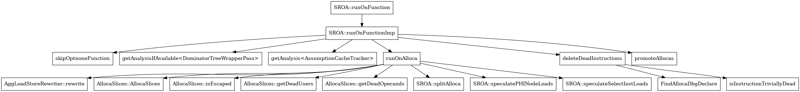

# DXIL Scalarization

* Proposal: [NNNN](NNNN-DXIL-Scalarization.md)
* Author(s): [Farzon Lotfi](https://github.com/farzonl)
* Sponsor: [Farzon Lotfi](https://github.com/farzonl)
* Status: **Under Consideration**
* Impacted Projects: Clang

## Introduction
As mentioned in [DXIL.rst](https://github.com/microsoft/DirectXShaderCompiler/blob/main/docs/DXIL.rst#vectors) 
"HLSL vectors are scalarized" and "Matrices are lowered to vectors". Therefore,
 we need to be able to scalarize these types in clang DirectX backend. Today 
this is done via the [SROA](https://github.com/microsoft/DirectXShaderCompiler/blob/e0fbce714da4746477639d82185ae76f6df4f472/lib/Transforms/Scalar/SROA.cpp#L1240)
function pass. This pass exists in upstream, which should make this effort easier.
However, it has a few code paths disabled

## HLSL specific SROA Behavior Differences
- [Disable **ForceSSAUpdater** and **SROAStrictInbounds**](https://github.com/microsoft/DirectXShaderCompiler/blob/e0fbce714da4746477639d82185ae76f6df4f472/lib/Transforms/Scalar/SROA.cpp#L83C1-L102C1)
- [`visitBitCastInst` HLSL type handling](https://github.com/microsoft/DirectXShaderCompiler/blob/e0fbce714da4746477639d82185ae76f6df4f472/lib/Transforms/Scalar/SROA.cpp#L710C5-L716C24)
- [`visitLoadInst` HLSL type handling](https://github.com/microsoft/DirectXShaderCompiler/blob/e0fbce714da4746477639d82185ae76f6df4f472/lib/Transforms/Scalar/SROA.cpp#L777C5-L780C24)
- [`visitStoreInst` HLSL type handling](https://github.com/microsoft/DirectXShaderCompiler/blob/e0fbce714da4746477639d82185ae76f6df4f472/lib/Transforms/Scalar/SROA.cpp#L797C5-L800C24)
- [Disable **SROARandomShuffleSlices**](https://github.com/microsoft/DirectXShaderCompiler/blob/e0fbce714da4746477639d82185ae76f6df4f472/lib/Transforms/Scalar/SROA.cpp#L1063C1-L1070C44)
- [Another `visitLoadInst` HLSL type handling](https://github.com/microsoft/DirectXShaderCompiler/blob/e0fbce714da4746477639d82185ae76f6df4f472/lib/Transforms/Scalar/SROA.cpp#L3366C5-L3369C24)
- [Another `visitStoreInst` HLSL type handling](https://github.com/microsoft/DirectXShaderCompiler/blob/e0fbce714da4746477639d82185ae76f6df4f472/lib/Transforms/Scalar/SROA.cpp#L3404C5-L3407C24)
- [Another `visitBitCastInst` HLSL type handling](https://github.com/microsoft/DirectXShaderCompiler/blob/e0fbce714da4746477639d82185ae76f6df4f472/lib/Transforms/Scalar/SROA.cpp#L3417C5-L3422C24)
- [Debug layout for stride](https://github.com/microsoft/DirectXShaderCompiler/blob/e0fbce714da4746477639d82185ae76f6df4f472/lib/Transforms/Scalar/SROA.cpp#L4303C5-L4317C24)
- Major change to handle strides [DXC:SROA4324-4352](https://github.com/microsoft/DirectXShaderCompiler/blob/e0fbce714da4746477639d82185ae76f6df4f472/lib/Transforms/Scalar/SROA.cpp#L4324C1-L4352C20)
- [ignore bool `alloca(s)`](https://github.com/microsoft/DirectXShaderCompiler/blob/e0fbce714da4746477639d82185ae76f6df4f472/lib/Transforms/Scalar/SROA.cpp#L4398C3-L4404C21)
- [skip alloca for HLSL types](https://github.com/microsoft/DirectXShaderCompiler/blob/e0fbce714da4746477639d82185ae76f6df4f472/lib/Transforms/Scalar/SROA.cpp#L4410C7-L4412C26)
- [move `dbg.declare(s)` removal to before `replaceAllUsesWith`](https://github.com/microsoft/DirectXShaderCompiler/blob/e0fbce714da4746477639d82185ae76f6df4f472/lib/Transforms/Scalar/SROA.cpp#L4479C5-L4488C24)
- [Disables original removal of `dbg.declare(s)`](https://github.com/microsoft/DirectXShaderCompiler/blob/e0fbce714da4746477639d82185ae76f6df4f472/lib/Transforms/Scalar/SROA.cpp#L4500C1-L4506C22)

## SROA Behavior as exists in DXC
The Call graph below performs 3 main functions

1. **Populate a list of Allocas**: It populates a worklist with alloca instructions (memory allocations) from the function's entry block.
2. **Processing Allocas**: For each alloca in the worklist, `runOnAlloca` performs 
various transformations:
- - Handles dead allocas and special cases.
  - Rewrites aggregate loads and stores.
  - Splits allocas into smaller pieces (slices) and handles dead users and 
  operands.
  - Speculates on PHI and select instructions for further optimization 
  opportunities.
3. Promotion and Cleanup: After processing allocas, it promotes them to registers if possible (`promoteAllocas`), then deletes any instructions marked as dead (`deleteDeadInstructions`).


### SROA::runOnFunction(Function &F)

- This function attempts to run the SROA optimization on the given function F.
It has a loop that runs up to three times (kMaxCount), calling `runOnFunctionImp(F)` each time.
- If `runOnFunctionImp(F)` returns false, the loop breaks early. It returns 
true if the function was modified in at least one of the iterations, otherwise 
it returns false.

### SROA::runOnFunctionImp(Function &F)

- This function performs the actual SROA optimization.
It first checks if the function should be skipped by calling skipOptnoneFunction(F).
- It sets up some analysis passes like Dominator Tree and Assumption Cache.
- It initializes the Worklist with alloca instructions from the entry block of 
the function.
- It then iterates over the worklist, calling `runOnAlloca` for each alloca and
 managing a set of deleted allocas to avoid reprocessing them.
- It promotes allocas using `promoteAllocas(F)`.
- It loops until the worklist is empty and returns true if any changes were 
made.

### SROA::runOnAlloca(AllocaInst &AI)

This function performs SROA on a single alloca instruction.
- It first handles dead allocas and special cases, such as those with types it cannot process.
- It rewrites aggregate loads and stores via AggLoadStoreRewriter.
- It builds slices of the alloca using AllocaSlices.
- It deletes dead users and operands of the alloca.
- It splits the alloca if possible, and speculates on PHIs and select instructions.
- Returns true if any changes were made.

### SROA::deleteDeadInstructions(SmallPtrSetImpl<AllocaInst > &DeletedAllocas)

- This function deletes instructions that have been marked as dead.
- It handles special cases for alloca instructions by removing related 
`dbg.declare` instructions.
- It replaces all uses of the dead instruction with undef.
- It recursively checks the operands of the dead instruction to see if they 
also become dead.
- It increments a counter for the number of deleted instructions and removes 
the instruction from the parent.

## SROA Scalarization Examples
### HLSL Vector
```cpp
export float4 fn() {
    float4 r = float4(1.0f,1.0f,1.0f,1.0f);
    return r;
}
```
### LLVM Vector IR
- All Passes off (NO SROA): https://hlsl.godbolt.org/z/TqY9K75ha
```llvm
define <4 x float> @"fn"() #0 {
  %r = alloca <4 x float>, align 4
  %1 = bitcast <4 x float>* %r to i8*
  call void @llvm.lifetime.start(i64 16, i8* %1) #0
  call void @llvm.dbg.declare(metadata <4 x float>* %r, metadata !39, metadata !40)
  store <4 x float> <float 1.000000e+00, float 1.000000e+00, float 1.000000e+00, float 1.000000e+00>, <4 x float>* %r, align 4
  %2 = load <4 x float>, <4 x float>* %r, align 4
  %3 = bitcast <4 x float>* %r to i8*
  call void @llvm.lifetime.end(i64 16, i8* %3) #0
  ret <4 x float> %2
}
```
- With Default Passes: https://hlsl.godbolt.org/z/Eq3f974ef
-  vector alloca is gone (related to SROA Pass)
- `llvm.dbg.declare` becomes `llvm.dbg.value` (related to SROA Pass)
- no vector store (`SROA::handleLoadOrStore` could be involved)
- no vector load  (`SROA::handleLoadOrStore` could be involved)
- no vector bitcast
```llvm
define <4 x float> @"\01?fn@@YA?AV?$vector@M$03@@XZ"() #0 {
  call void @llvm.dbg.value(metadata <4 x float> <float 1.000000e+00, float 1.000000e+00, float 1.000000e+00, float 1.000000e+00>, i64 0, metadata !32, metadata !33)
  ret <4 x float> <float 1.000000e+00, float 1.000000e+00, float 1.000000e+00, float 1.000000e+00>
}
```

### HLSL Vector
```cpp
export float4 fn(float2 a, float2 b) {
    float4 r = float4(a.xy, b.xy);
    return r;
}
```
### LLVM Vector IR
- All passes off: https://hlsl.godbolt.org/z/q6bo5GPzs
```llvm
define <4 x float> @"fn"(<2 x float> %a, <2 x float> %b) #0 {
  %1 = alloca <2 x float>, align 4
  %2 = alloca <2 x float>, align 4
  %r = alloca <4 x float>, align 4
  store <2 x float> %b, <2 x float>* %1, align 4
  call void @llvm.dbg.declare(metadata <2 x float>* %1, metadata !51, metadata !52)
  store <2 x float> %a, <2 x float>* %2, align 4
  call void @llvm.dbg.declare(metadata <2 x float>* %2, metadata !54, metadata !52)
  %3 = bitcast <4 x float>* %r to i8*
  call void @llvm.lifetime.start(i64 16, i8* %3) #0
  call void @llvm.dbg.declare(metadata <4 x float>* %r, metadata !57, metadata !52)
  %4 = load <2 x float>, <2 x float>* %2, align 4
  %5 = shufflevector <2 x float> %4, <2 x float> undef, <2 x i32> <i32 0, i32 1>
  %6 = extractelement <2 x float> %5, i64 0
  %7 = extractelement <2 x float> %5, i64 1
  %8 = load <2 x float>, <2 x float>* %1, align 4
  %9 = shufflevector <2 x float> %8, <2 x float> undef, <2 x i32> <i32 0, i32 1>
  %10 = extractelement <2 x float> %9, i64 0
  %11 = extractelement <2 x float> %9, i64 1
  %12 = insertelement <4 x float> undef, float %6, i64 0
  %13 = insertelement <4 x float> %12, float %7, i64 1
  %14 = insertelement <4 x float> %13, float %10, i64 2
  %15 = insertelement <4 x float> %14, float %11, i64 3
  store <4 x float> %15, <4 x float>* %r, align 4
  %16 = load <4 x float>, <4 x float>* %r, align 4
  %17 = bitcast <4 x float>* %r to i8*
  call void @llvm.lifetime.end(i64 16, i8* %17) #0
  ret <4 x float> %16
}
```
- With Default Passes: https://hlsl.godbolt.org/z/Y19YTs3Gf
- vector `alloca`, `load`. `store` are elminated
- vec2 extracts and vec4 inserts collapsed into one shufflevector
```llvm
define <4 x float> @"fn"(<2 x float> %a, <2 x float> %b) #0 {
call void @llvm.dbg.value(metadata <2 x float> %b, i64 0, metadata !42, metadata !43)
call void @llvm.dbg.value(metadata <2 x float> %a, i64 0, metadata !45, metadata !43)
%1 = shufflevector <2 x float> %a, <2 x float> %b, <4 x i32> <i32 0, i32 1, i32 2, i32 3>
ret <4 x float> %1
}
```
## Other Scalarization Examples
### `groupshared` HLSL Vector(s)
```cpp
groupshared float3 sharedData[2];
export void fn2() {
    sharedData[0] = float3(1.0f, 2.0f, 3.0f);
    sharedData[1] = float3(2.0f, 4.0f, 6.0f);
}
```
### `groupshared` Vector LLVM IR
For `groupshared` each scalar in the vectors is converted into store calls.
In total between the two float3 that means 6 stores.
```llvm
 store float 1.000000e+00, float addrspace(3)* getelementptr inbounds ([6 x float], [6 x float] addrspace(3), i32 0, i32 0), align 4, 
  store float 2.000000e+00, float addrspace(3)* getelementptr inbounds ([6 x float], [6 x float] addrspace(3), i32 0, i32 1), align 4, 
  store float 3.000000e+00, float addrspace(3)* getelementptr inbounds ([6 x float], [6 x float] addrspace(3), i32 0, i32 2), align 4, 
  store float 2.000000e+00, float addrspace(3)* getelementptr inbounds ([6 x float], [6 x float] addrspace(3), i32 0, i32 3), align 4, 
  store float 4.000000e+00, float addrspace(3)* getelementptr inbounds ([6 x float], [6 x float] addrspace(3), i32 0, i32 4), align 4, 
  store float 6.000000e+00, float addrspace(3)* getelementptr inbounds ([6 x float], [6 x float] addrspace(3), i32 0, i32 5), align 4, 
```

### `groupshared` HLSL Matrix
```cpp
groupshared float2x2 sharedData[2];
export void fn2() {
    sharedData[0] = float2x2(1.0f, 2.0f, 3.0f,4.0f);
    sharedData[1] = float2x2(2.0f, 4.0f, 6.0f,8.0f);
}
```
### `groupshared` Matrix LLVM IR
Same behavior as  vector
```llvm
store float 1.000000e+00, float addrspace(3)* getelementptr inbounds ([8 x float], [8 x float] addrspace(3)* , i32 0, i32 0), align 16,
  store float 3.000000e+00, float addrspace(3)* getelementptr inbounds ([8 x float], [8 x float] addrspace(3)* , i32 0, i32 1), align 4,
  store float 2.000000e+00, float addrspace(3)* getelementptr inbounds ([8 x float], [8 x float] addrspace(3)* , i32 0, i32 2), align 8,
  store float 4.000000e+00, float addrspace(3)* getelementptr inbounds ([8 x float], [8 x float] addrspace(3)* , i32 0, i32 3), align 4,
  store float 2.000000e+00, float addrspace(3)* getelementptr inbounds ([8 x float], [8 x float] addrspace(3)* , i32 0, i32 4), align 16,
  store float 6.000000e+00, float addrspace(3)* getelementptr inbounds ([8 x float], [8 x float] addrspace(3)* , i32 0, i32 5), align 4,
  store float 4.000000e+00, float addrspace(3)* getelementptr inbounds ([8 x float], [8 x float] addrspace(3)* , i32 0, i32 6), align 8,
  store float 8.000000e+00, float addrspace(3)* getelementptr inbounds ([8 x float], [8 x float] addrspace(3)* , i32 0, i32 7), align 4,

```
### RW Buffer HLSL Vector(s)
```cpp
RWStructuredBuffer<float4> buffer4 : register(u0);
RWStructuredBuffer<float3> buffer3 : register(u1);
RWStructuredBuffer<float2> buffer2 : register(u2);
export void fn3() {
    buffer4[0] = float4(1.0f, 2.0f, 3.0f,1.0f);
    buffer3[0] = float3(1.0f, 2.0f, 3.0f);
    buffer2[0] = float2(1.0f, 2.0f);
}
```
### RW Buffer LLVM IR
For read write buffers one ten param `rawBufferStore` is called. The vector is 
then serialized into parameter index equal to 4 through 7. If the vector size 
is less than 4 use undefs for the delta in size.

```llvm
call void @dx.op.rawBufferStore.f32(i32 140, %dx.types.Handle %5, i32 0, i32 0, float 1.000000e+00, float 2.000000e+00, float 3.000000e+00, float 1.000000e+00, i8 15, i32 4), 

call void @dx.op.rawBufferStore.f32(i32 140, %dx.types.Handle %7, i32 0, i32 0, float 1.000000e+00, float 2.000000e+00, float 3.000000e+00, float undef, i8 7, i32 4), 

call void @dx.op.rawBufferStore.f32(i32 140, %dx.types.Handle %9, i32 0, i32 0, float 1.000000e+00, float 2.000000e+00, float undef, float undef, i8 3, i32 4), 
```
### Texture2D HLSL Vector(s)
```cpp
Texture2D<float4> tex : register(t0);
SamplerState aSampler : register(s0);
export float4 fn4() {
    return tex.Sample(aSampler, 2.0f);
}
```
### Texture2D LLVM IR
For Texture2D a sample is returned as a `dx.types.ResRet` The scalars are then individually extracted and added to a float vector before being returned.
```llvm
%7 = call %dx.types.ResRet.f32 @dx.op.sample.f32(i32 60, %dx.types.Handle %4, %dx.types.Handle %6, float 2.000000e+00, float 2.000000e+00, float undef, float undef, i32 0, i32 0, i32 undef, float undef), 
  %8 = extractvalue %dx.types.ResRet.f32 %7, 0, 
  %9 = insertelement <4 x float> undef, float %8, i64 0, 
  %10 = extractvalue %dx.types.ResRet.f32 %7, 1, 
  %11 = insertelement <4 x float> %9, float %10, i64 1, 
  %12 = extractvalue %dx.types.ResRet.f32 %7, 2, 
  %13 = insertelement <4 x float> %11, float %12, i64 2, 
  %14 = extractvalue %dx.types.ResRet.f32 %7, 3, 
  %15 = insertelement <4 x float> %13, float %14, i64 3, 
  ret <4 x float> %15, 
```

## Path forward
Step one should be enable SROA as a pass that runs on the DirectX backend. Then 
add modifications to support strides.